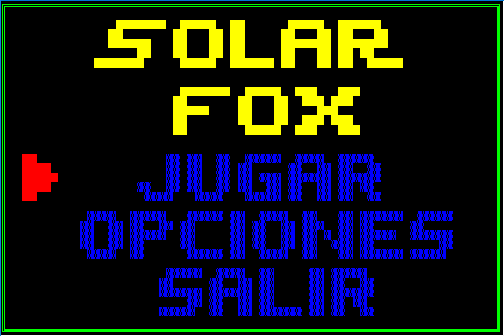
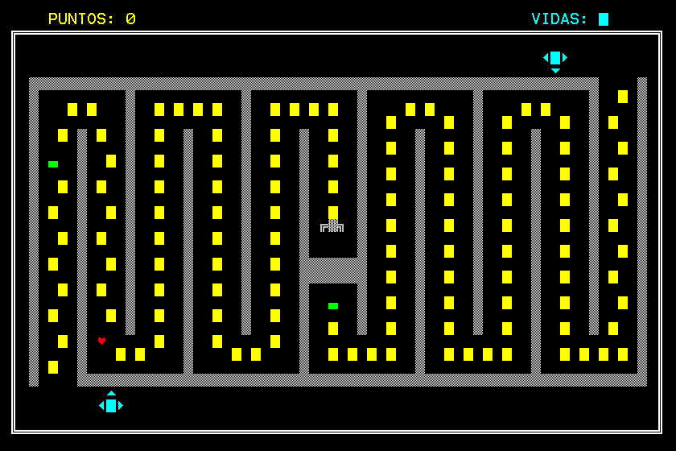
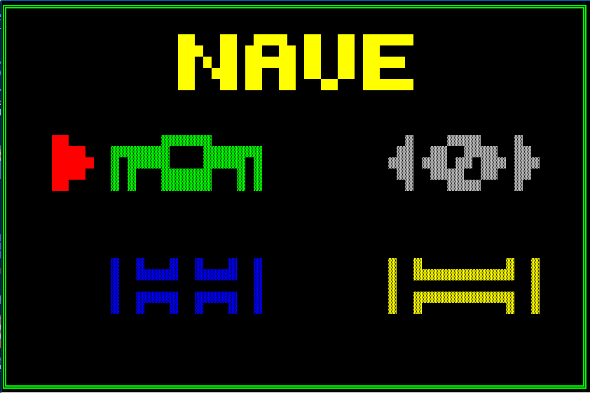

# Solar Fox UPC
### Game based on Atari game Solar Fox and developed as final project of the programming 1 course at UPC.
---
#### Instructions: 
- Pause game			=>	'P'
- Select option	=>	'ENTER'
- Go back		=>	'ESC'
- Move page	=>	'->' '<-'
- Move spaceship	=>	'W' 'A' 'S' 'D'
---
#### Screenshots:

#### Made by <a href = "https://github.com/RodrigoAGM">@RodrigoAGM </a> :peru:
